# PrepSense AI

**AI-powered interview preparation platform** — analyze any job description against your profile and get a personalized interview strategy in seconds.

---

## Screenshots

| Home | Interview Strategy |
|---|---|
| 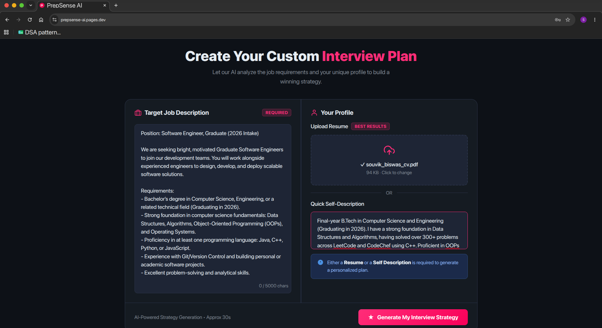 | 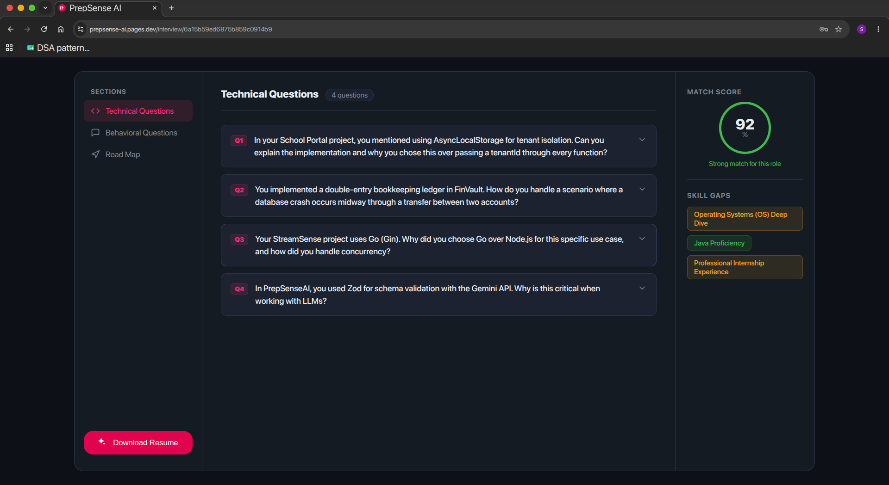 |

| Login | Register |
|---|---|
| 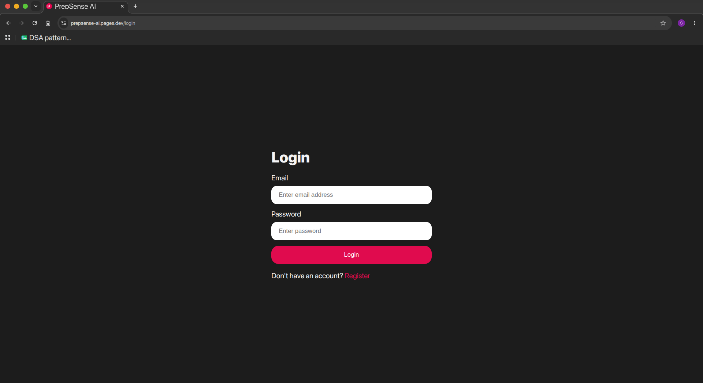 | 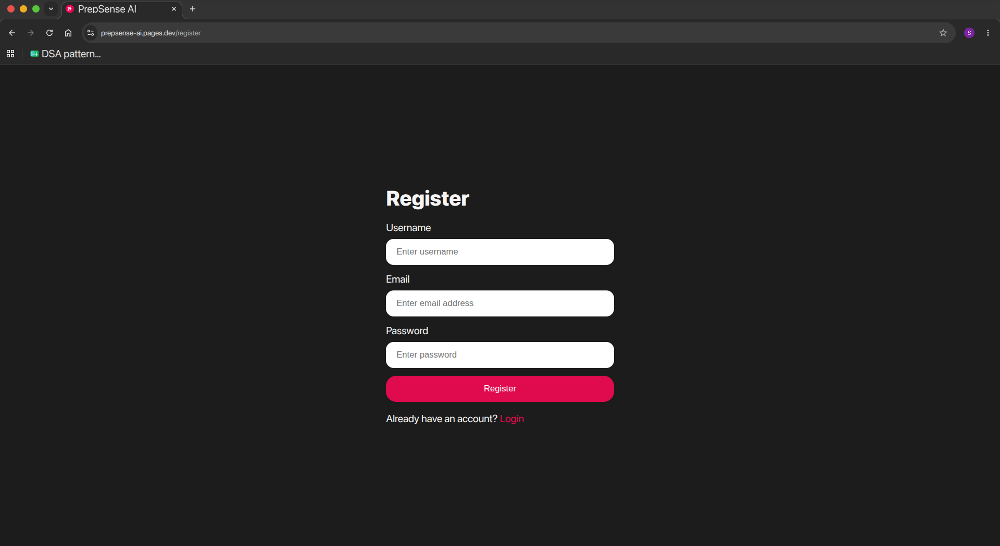 |

---

## What It Does

Upload your resume and paste a job description. PrepSense uses Google Gemini to:

- **Score your match** against the role (0–100)
- **Generate tailored questions** — both technical and behavioral — with model answers and interviewer intent
- **Identify skill gaps** with severity ratings
- **Build a day-by-day prep roadmap** specific to that job
- **Generate a tailored resume PDF** optimized for ATS and the target role

---

## Tech Stack

| Layer | Tech |
|---|---|
| Frontend | React 19, Vite, SCSS |
| Backend | Node.js, Express 5 |
| Database | MongoDB (Mongoose) |
| AI | Google Gemini (`@google/genai`) |
| Auth | JWT + HTTP-only cookies |
| PDF | Puppeteer (resume generation), pdf-parse (resume parsing) |

---

## Project Structure

```
PrepSense/
├── Backend/
│   ├── src/
│   │   ├── config/         # DB connection
│   │   ├── controllers/    # Route handlers
│   │   ├── middlewares/    # Auth, file upload
│   │   ├── models/         # Mongoose schemas
│   │   ├── routes/         # Express routers
│   │   └── services/       # AI service (Gemini)
│   └── server.js
└── Frontend/
    └── src/
        └── features/
            ├── auth/       # Login, Register, Protected routes
            └── interview/  # Home, Interview report pages
```

---

## Getting Started

### Prerequisites

- Node.js 18+
- MongoDB instance
- Google Gemini API key

### Backend

```bash
cd Backend
npm install
```

Create a `.env` file:

```env
PORT=3000
MONGO_URI=your_mongodb_connection_string
JWT_SECRET=your_jwt_secret
GOOGLE_GENAI_API_KEY=your_gemini_api_key
```

```bash
npm run dev
```

### Frontend

```bash
cd Frontend
npm install
npm run dev
```

App runs at `http://localhost:5173`, API at `http://localhost:3000`.

---

## Key API Endpoints

| Method | Endpoint | Description |
|---|---|---|
| POST | `/api/auth/register` | Register a new user |
| POST | `/api/auth/login` | Login and receive JWT cookie |
| POST | `/api/auth/logout` | Logout (blacklist token) |
| POST | `/api/interview/generate` | Generate interview report (multipart) |
| GET | `/api/interview/reports` | Get all reports for current user |
| GET | `/api/interview/report/:id` | Get a single report |
| GET | `/api/interview/resume/:id` | Download tailored resume PDF |

---

## Low-Level Design

### Class Diagram

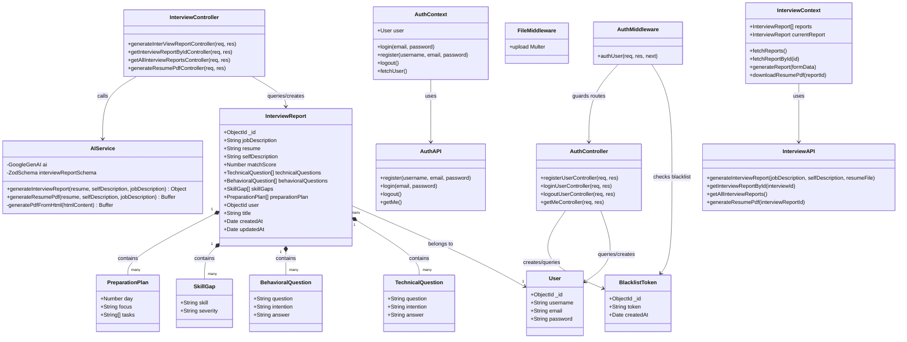

---

### Sequence Diagrams

#### User Registration

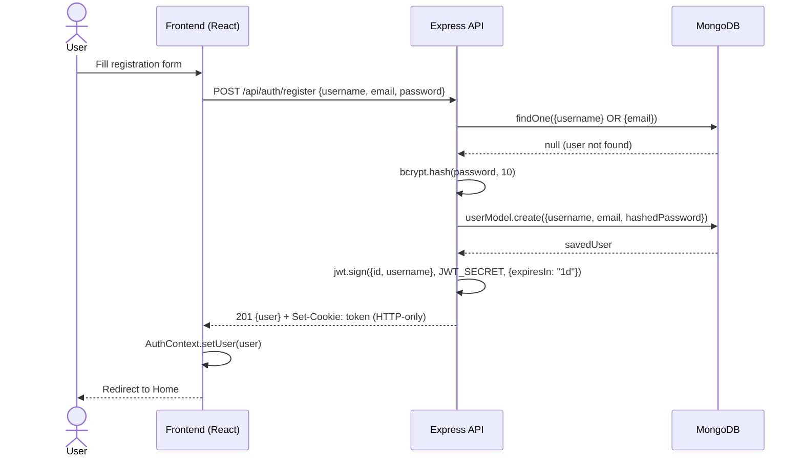

#### User Login

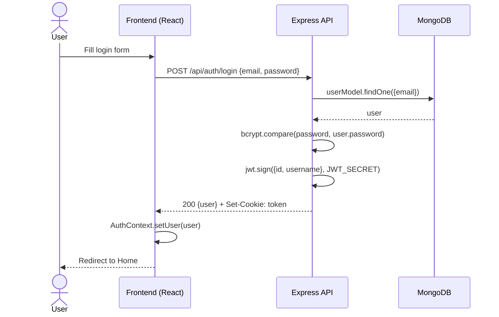

#### User Logout

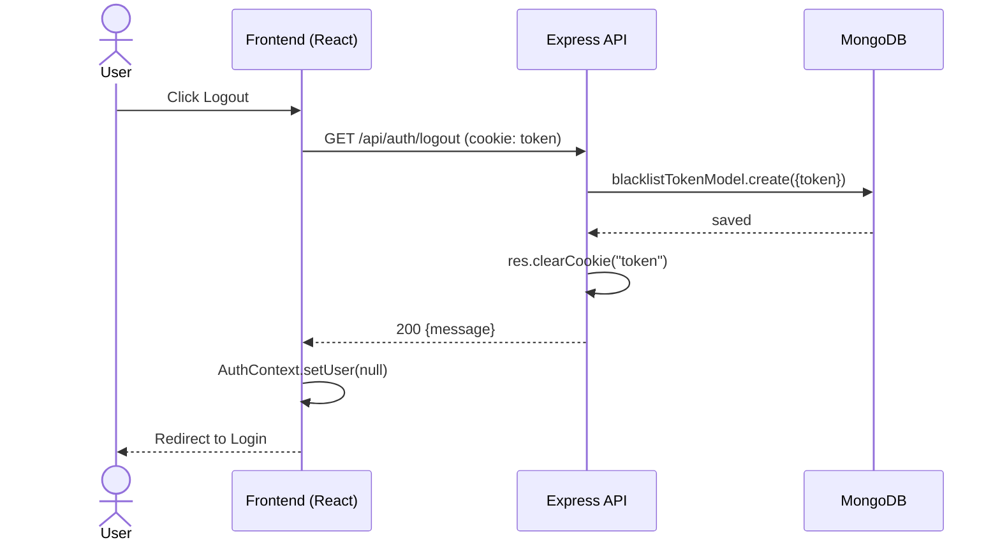

#### Generate Interview Report

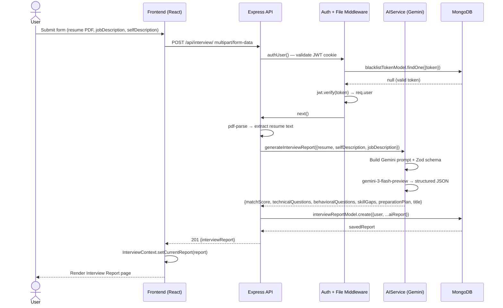

#### Get All Interview Reports

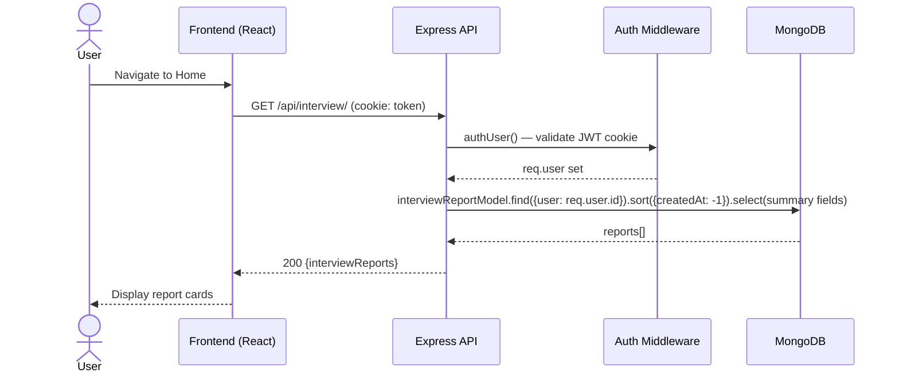

#### Download Tailored Resume PDF

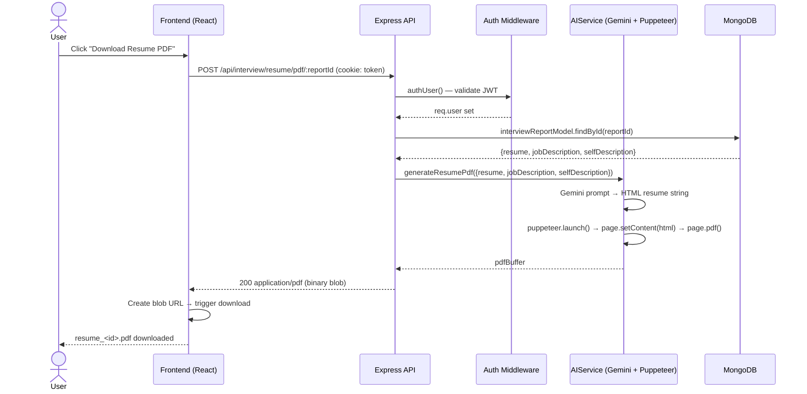

---

## License

MIT
